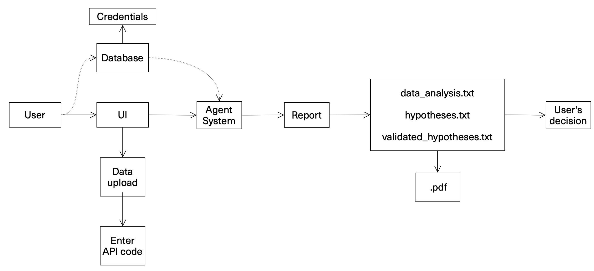
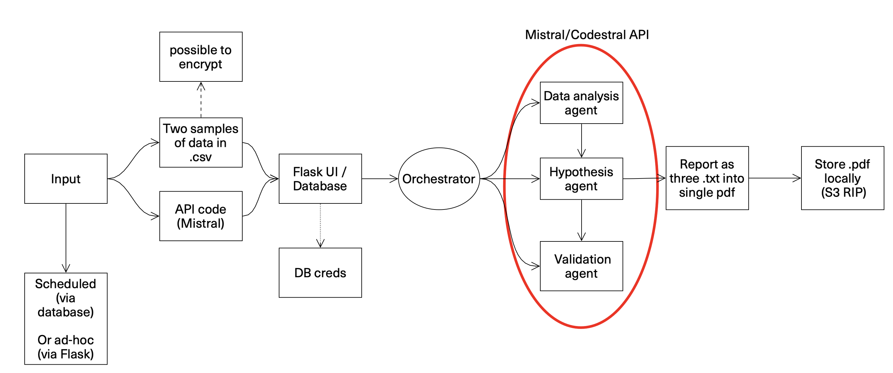
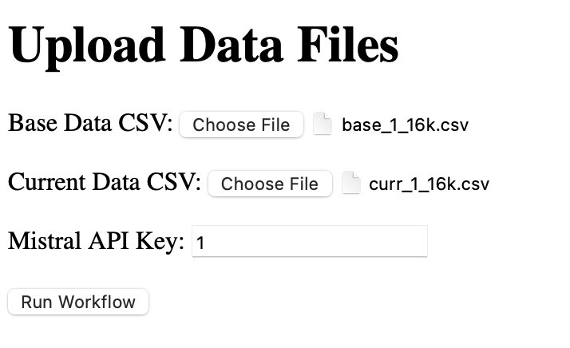
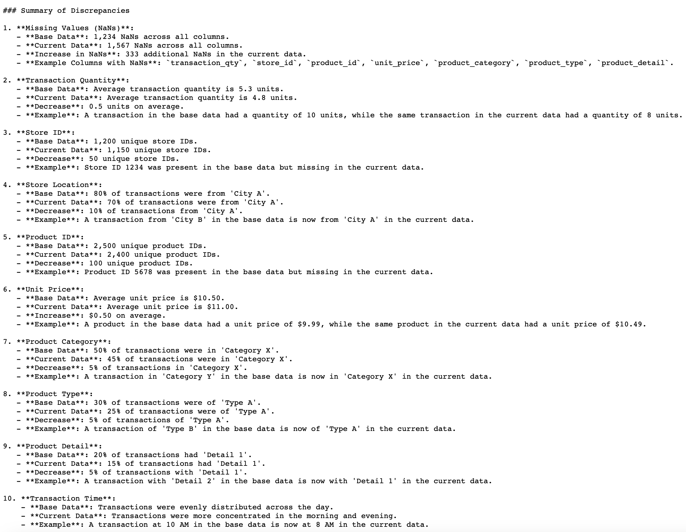
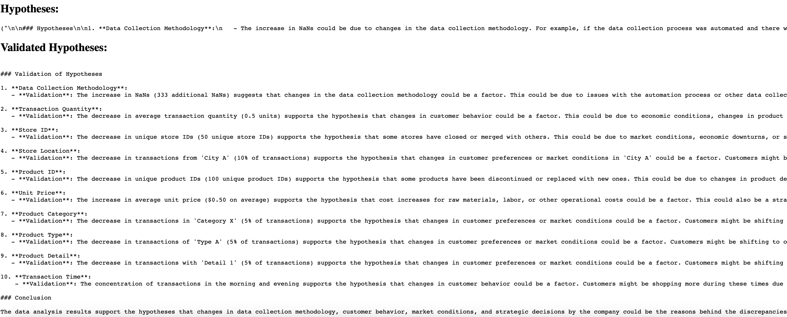

# DataQuestioner


LLM-based system for automated business data analysis, hypothesis generation, and validation using Mistral-based models.
Core idea is to regularly check for data-drift (whatever that means)

as a data example I took [coffeshop daily transactions data from kaggle](https://www.kaggle.com/datasets/agungpambudi/trends-product-coffee-shop-sales-revenue-dataset)

---

## Table of Contents

1. Folder Structure
2. Installation
3. Usage
4. CI/CD Pipeline
5. Diagrams (user-story and architecture)
6. Examples of input / output
7. Author

---

## Folder Structure

- **`agents_and_orchestrator/`**  
  Contains the orchestrator and agent modules for data analysis, hypothesis generation, and validation.  

- **`data_examples/`**  
  Example datasets in `.csv` format to test the system.  

- **`output_examples/`**  
  Sample outputs including `.txt` reports generated by the system.  

- **`tools/`**  
  Utility scripts for tasks like setting up the database, generating PDFs, and saving outputs locally.  

- **`main.yml`**  
  CI/CD pipeline configuration file for GitHub Actions.  

---

## Installation

### Prerequisites

- Python 3.8+
- pip
- A Mistral API key
- (Optional) Docker for database setup

### Steps

1. Clone the repository:
   ```bash
   git clone https://github.com/yourusername/your-repository.git
   cd your-repository

2. Install dependecies
```python pip install -r requirements.txt```

3. Set up Mistral API
```MISTRAL_API_KEY=your_api_key```

4. Run the orchestrator
   ```python orchestrator.py --base data_examples/base.csv --current data_examples/current.csv```

6. Start Flask server
   ``python app.py``
7. Open http://127.0.0.1:5000 in your browser.

### CI/CD
The repository uses GitHub Actions for continuous integration and deployment. The main.yml file in the root directory includes steps for:

- Running tests using pytest
- Linting the code with flake8
- Deploying the application (if configured)

### Diagrams
---



---



### Examples


---


---


### Author
Mikhail Ivanov
